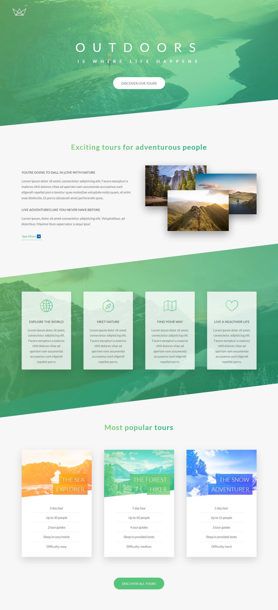
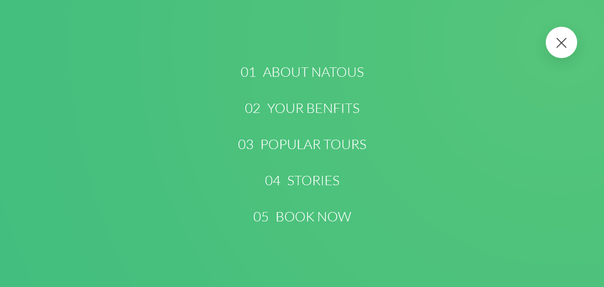
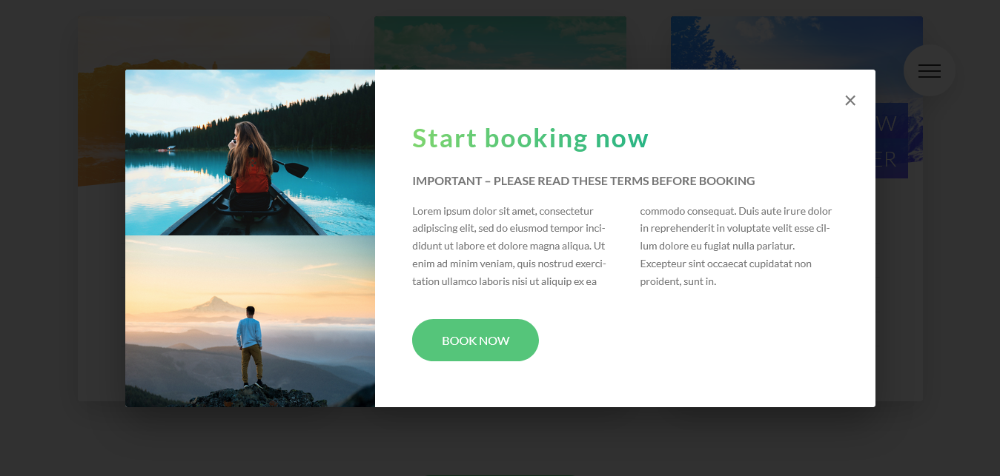

## Title-Info
> It is a responsive design for a Natural Tour Place website... 🤔

## ScreenShots

<!--  -->
<!-- {OnGoing} -->
- Screenshot 2

- Screenshot 2

## Built With
- HTML
- CSS3
- CSS Animation
- CSS Pesudo Element
- SASS
- VScode

## Getting Started
To get a local copy up and running you just need to follow the following steps;
- Clone this repository with
git clone https://github.com/asifmuntasir/responsive-webDesign-2.git using your terminal or command line.
- run code `.` to open it in vscode
- then open your vscode live server
- and enjoy the site

## Author

👤 **Asif Muntasir**

- GitHub: [Asif_Muntasir](https://github.com/asifmuntasir)
- LinkedIn: [Asi_fMuntasir](https://www.linkedin.com/in/asif-muntasir-shuaib/)
- Website: [Asif_Muntasir](https://asifmuntasir.github.io/)

## 🤝 Contributing

Contributions, issues, and feature requests are welcome!

Feel free to check the [issues page](../../issues/).

## Show your support

Give a ⭐️ if you like this project!

## Acknowledgments

- Jonas & Advance CSS

## 📝 License

This project is [MIT](./MIT.md) licensed.